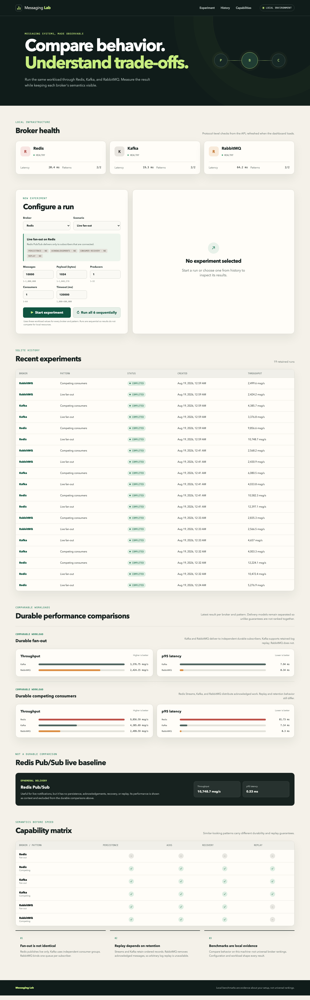
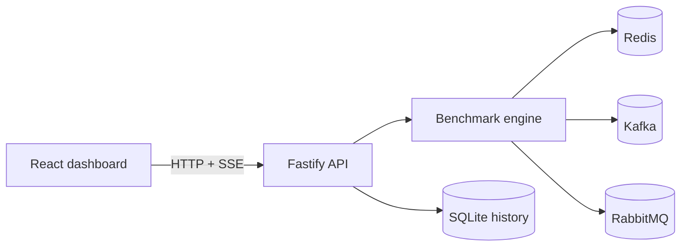

# Messaging Lab

Messaging Lab is a local-first dashboard for comparing how Redis, Kafka, and RabbitMQ implement live fan-out and competing-consumer messaging. It runs identical configurable workloads, streams progress in real time, and keeps each broker's delivery semantics visible beside the measurements.

This project is an educational lab, not a universal broker ranking. Results describe one workload, broker configuration, and host machine.



## What you can explore

- Compare durable fan-out and competing-consumer workloads in separate result groups; Redis Pub/Sub is shown only as an ephemeral live-delivery baseline.

- Run live fan-out and competing-consumer experiments against three real brokers.
- Queue all six broker/pattern combinations sequentially with one button.
- Configure message count, payload size, producer concurrency, consumers, and timeout.
- Watch publishing and consumption progress through Server-Sent Events (SSE).
- Compare throughput and p50/p95/p99 end-to-end latency.
- Inspect delivery counts, loss, duplicates, capability notes, and errors.
- Keep aggregate run history in SQLite across application restarts.
- See where persistence, acknowledgements, recovery, and replay are genuinely supported.

The current “Run all 6 sequentially” action is coordinated by the browser. It
starts one ordinary run after another, and each result is persisted separately.
Reloading or closing the dashboard stops the remaining browser queue, although
the active API run continues. Persistent suites, repetitions, and aggregate
statistics are planned but are not implemented yet.

## Quick start

### Prerequisites

- Docker Engine with Docker Compose
- At least 4 GB of memory available to Docker
- Node.js 22.12+ and npm 10+ only when running development or verification commands outside containers

Start the complete stack:

```sh
cp .env.example .env
npm run docker:up
```

Open <http://localhost:5173>. The API is available at <http://localhost:3000>, and RabbitMQ management is available at <http://localhost:15672>.

Stop the stack without deleting persisted data:

```sh
npm run docker:down
```

See [local development](docs/local-development.md) for port overrides, logs, and source-based workflows.

## Architecture



| Workspace         | Responsibility                                                         |
| ----------------- | ---------------------------------------------------------------------- |
| `apps/web`        | React/Vite dashboard, API client, live state, charts, and explanations |
| `apps/api`        | Fastify routes, run lifecycle, benchmark engine, adapters, and SQLite  |
| `packages/shared` | Zod contracts, domain types, limits, and capability metadata           |
| `scripts`         | Docker Compose wrapper and isolated full-stack smoke verification      |

The API permits one active run at a time. Every run receives isolated broker resource names; completion, cancellation, timeout, and failure all enter the cleanup path.

The dashboard can queue all six broker/pattern combinations, but that queue is
currently frontend state rather than an API resource. See the architecture
document for the current execution flow and its limitations.

More detail and messaging-flow diagrams are in [architecture](docs/architecture.md).

## Broker comparison

| Broker and pattern                | Persistence | Acknowledgements | Recovery | Replay | Implementation                                |
| --------------------------------- | :---------: | :--------------: | :------: | :----: | --------------------------------------------- |
| Redis Pub/Sub fan-out             |     No      |        No        |    No    |   No   | Live subscribers receive each publication     |
| Redis Streams competing consumers |     Yes     |       Yes        |   Yes    |  Yes   | One stream and consumer group                 |
| Kafka fan-out                     |     Yes     |       Yes        |   Yes    |  Yes   | One consumer group per subscriber             |
| Kafka competing consumers         |     Yes     |       Yes        |   Yes    |  Yes   | Consumers share partitions in one group       |
| RabbitMQ fan-out                  |     Yes     |       Yes        |   Yes    |   No   | Fanout exchange with one queue per subscriber |
| RabbitMQ competing consumers      |     Yes     |       Yes        |   Yes    |   No   | Consumers share one queue                     |

“Replay” means intentionally reading retained messages again. RabbitMQ can redeliver unacknowledged messages after recovery, but it does not provide Kafka-style arbitrary replay from a retained log. Redis Pub/Sub is intentionally ephemeral.

## Benchmark methodology

The default experiment publishes 10,000 deterministic 1 KiB payloads with one producer and one consumer. A short untimed warm-up precedes measurement. The timed interval covers publication and expected consumption; broker resource provisioning and cleanup are excluded.

Latency uses monotonic timestamps in the API process, and at most 10,000 latency observations are retained in memory. Only aggregate metrics are persisted.

Read [benchmark methodology](docs/benchmark-methodology.md) before interpreting results. It documents metric definitions, configuration limits, known limitations, and responsible comparison practices.

## Commands

| Command                    | Purpose                                                       |
| -------------------------- | ------------------------------------------------------------- |
| `npm run docker:up`        | Build and start the complete local stack                      |
| `npm run docker:down`      | Stop the stack while retaining named volumes                  |
| `npm run docker:logs`      | Follow Compose service logs                                   |
| `npm run dev`              | Run workspace development watchers and the Vite server        |
| `npm run format:check`     | Verify Prettier formatting                                    |
| `npm run lint`             | Run ESLint                                                    |
| `npm run typecheck`        | Type-check all workspaces                                     |
| `npm test`                 | Run unit, API, and component tests                            |
| `npm run build`            | Build TypeScript projects and the production dashboard bundle |
| `npm run test:integration` | Exercise all broker adapters and scenarios against Docker     |
| `npm run test:smoke`       | Build an isolated stack and complete a default persisted run  |

The Docker-backed commands require a running Docker daemon. The smoke test uses isolated ports, project resources, and volumes, then removes everything it created.

## Documentation

- [Local development](docs/local-development.md)
- [Architecture and messaging flows](docs/architecture.md)
- [Benchmark methodology and interpretation](docs/benchmark-methodology.md)
- [HTTP API and environment variables](docs/api.md)

## License

Released under the [MIT License](LICENSE).
