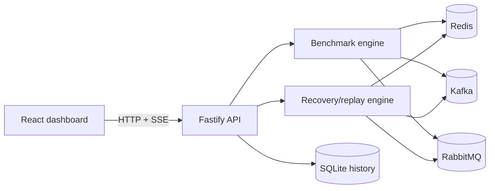

# Messaging Lab

Messaging Lab is a local-first dashboard for exploring how Redis, Kafka, and RabbitMQ implement live fan-out and competing-consumer messaging. It runs configurable workloads, streams progress in real time, and keeps each broker's delivery semantics visible beside the measurements.

This project is an educational lab, not a universal broker ranking. Results describe one workload, broker configuration, and host machine.


## What you can explore

- Compare Kafka and RabbitMQ as the primary architectural trade-off, within matching scenarios.
- Inspect Redis Streams in an adjacent streaming track and Redis Pub/Sub only as an ephemeral baseline.

- Run live fan-out and competing-consumer experiments against three real brokers.
- Build persistent suites from selected broker/pattern combinations.
- Configure suite repetitions, fixed/rotating/randomized order, and cooldown.
- Sweep consumers, producers, payload size, or message count along one safe axis and inspect track-specific curves.
- Add artificial consumer delay, sweep it, and inspect latency and application-observed backlog curves.
- Configure message count, payload size, producer concurrency, consumers, and timeout.
- Watch publishing and consumption progress through Server-Sent Events (SSE).
- Compare throughput and p50/p95/p99 end-to-end latency.
- Inspect delivery counts, loss, duplicates, capability notes, and errors.
- Inspect global and broker-native-scope ordering violations independently.
- Keep aggregate run history in SQLite across application restarts.
- Restore active suites after reload and inspect their ordered trials and failures.
- Compare repeated trials with medians, quartiles, ranges, anomaly totals, and low-sample warnings.
- Export every suite and its underlying trials as JSON or CSV.
- Inspect and export privacy-conscious environment provenance for reproducibility.
- Filter and paginate history by broker, scenario, status, suite, and date.
- Name experiments, save local workload presets, and compare compatible selections.
- Explicitly delete terminal local history with suite-aware cascading.
- See where persistence, acknowledgements, recovery, and replay are genuinely supported.
- Run broker-native recovery and replay demonstrations with deterministic consumer interruption, observed delivery anomalies, and cleanup evidence.

Suites are coordinated and persisted by the API, not the browser. They continue
if the dashboard reloads or disconnects, retain their complete execution order,
and keep failed, timed-out, and cancelled trials visible. Distribution-aware
aggregate statistics use successful trials without hiding unsuccessful ones.
One-dimensional parameter sweeps expand into ordinary persisted suite trials,
so they use the same repetition, ordering, cooldown, and cancellation behavior.
A suite can generate at most 100 runs, including all sweep points.
At creation, each new suite also records application/runtime versions, safe host
characteristics, broker images, and sanitized adapter settings without storing
hostnames, paths, endpoints, or credentials.

## Quick start

### Prerequisites

- Docker Engine with Docker Compose
- At least 4 GB of memory available to Docker
- Node.js 22.12+ and npm 10+ only when running development or verification commands outside containers

Start the complete stack:

```sh
cp .env.example .env
npm run docker:up
```

Open <http://localhost:5173>. The API is available at <http://localhost:3000>, and RabbitMQ management is available at <http://localhost:15672>.

Stop the stack without deleting persisted data:

```sh
npm run docker:down
```

See the [technical reference](docs/reference.md#local-operation) for port
overrides, logs, and source-based workflows.

## Architecture



| Workspace         | Responsibility                                                         |
| ----------------- | ---------------------------------------------------------------------- |
| `apps/web`        | React/Vite dashboard, API client, live state, charts, and explanations |
| `apps/api`        | Fastify routes, run lifecycle, benchmark engine, adapters, and SQLite  |
| `packages/shared` | Zod contracts, domain types, limits, and capability metadata           |
| `scripts`         | Docker Compose wrapper and isolated full-stack smoke verification      |

The API permits one active run at a time. A persistent suite reserves that run
lane while it serially schedules its trials. Every run receives isolated broker
resource names; completion, cancellation, timeout, and failure all enter the
cleanup path.

The dashboard creates and observes server-managed suites through validated JSON
and SSE contracts. Run and suite selections have stable URLs, and suite history
groups every trial while leaving standalone runs visible.

More detail and messaging-flow diagrams are in the
[technical reference](docs/reference.md#architecture).

## Broker comparison

The dashboard uses three explicit tracks. `primary` contains only Kafka and
RabbitMQ. `adjacent-streaming` contains Redis Streams. `ephemeral-baseline`
contains Redis Pub/Sub and is never included in a durable-system ranking.
Mixed suites may schedule all three, but statistics and conclusions remain
separated. See [ADR 0001](docs/adr/0001-semantic-comparison-tracks.md).

| Broker and pattern                | Persistence | Acknowledgements | Recovery | Replay | Implementation                                |
| --------------------------------- | :---------: | :--------------: | :------: | :----: | --------------------------------------------- |
| Redis Pub/Sub fan-out             |     No      |        No        |    No    |   No   | Live subscribers receive each publication     |
| Redis Streams competing consumers |     Yes     |       Yes        |   Yes    |  Yes   | One stream and consumer group                 |
| Kafka fan-out                     |     Yes     |       Yes        |   Yes    |  Yes   | One consumer group per subscriber             |
| Kafka competing consumers         |     Yes     |       Yes        |   Yes    |  Yes   | Consumers share partitions in one group       |
| RabbitMQ fan-out                  |     Yes     |       Yes        |   Yes    |   No   | Fanout exchange with one queue per subscriber |
| RabbitMQ competing consumers      |     Yes     |       Yes        |   Yes    |   No   | Consumers share one queue                     |

“Replay” means intentionally reading retained messages again. RabbitMQ can redeliver unacknowledged messages after recovery, but it does not provide Kafka-style arbitrary replay from a retained log. Redis Pub/Sub is intentionally ephemeral.

## Benchmark methodology

The default experiment publishes 10,000 deterministic 1 KiB payloads with one producer and one consumer. A short untimed warm-up precedes measurement. The timed interval covers publication and expected consumption; broker resource provisioning and cleanup are excluded.

Latency uses monotonic timestamps in the API process, and at most 10,000 latency observations are retained in memory. Only aggregate metrics are persisted.

Read the [experiment guide](docs/experiments.md) before interpreting results.
It documents recipes, metric definitions, limits, and responsible comparison
practices.

## Commands

| Command                    | Purpose                                                       |
| -------------------------- | ------------------------------------------------------------- |
| `npm run docker:up`        | Build and start the complete local stack                      |
| `npm run docker:down`      | Stop the stack while retaining named volumes                  |
| `npm run docker:logs`      | Follow Compose service logs                                   |
| `npm run dev`              | Run workspace development watchers and the Vite server        |
| `npm run format:check`     | Verify Prettier formatting                                    |
| `npm run lint`             | Run ESLint                                                    |
| `npm run typecheck`        | Type-check all workspaces                                     |
| `npm test`                 | Run unit, API, and component tests                            |
| `npm run build`            | Build TypeScript projects and the production dashboard bundle |
| `npm run test:integration` | Exercise all broker adapters and scenarios against Docker     |
| `npm run test:e2e`         | Run Playwright against an isolated Docker Compose stack       |
| `npm run test:smoke`       | Build an isolated stack and complete a default persisted run  |

The Docker-backed commands require a running Docker daemon. The E2E and smoke
tests use isolated ports, project resources, and volumes, then remove everything
they create. Install the E2E Chromium binary once with
`npm run test:e2e:install`.

## Documentation

- [Contributing guide](CONTRIBUTING.md)
- [Roadmap](ROADMAP.md)
- [Experiment guide](docs/experiments.md)
- [Technical reference](docs/reference.md)
- [Semantic comparison tracks ADR](docs/adr/0001-semantic-comparison-tracks.md)
- [Serial server-managed suites ADR](docs/adr/0002-serial-server-managed-suites.md)
- [Changelog](CHANGELOG.md)

## License

Released under the [MIT License](LICENSE).
