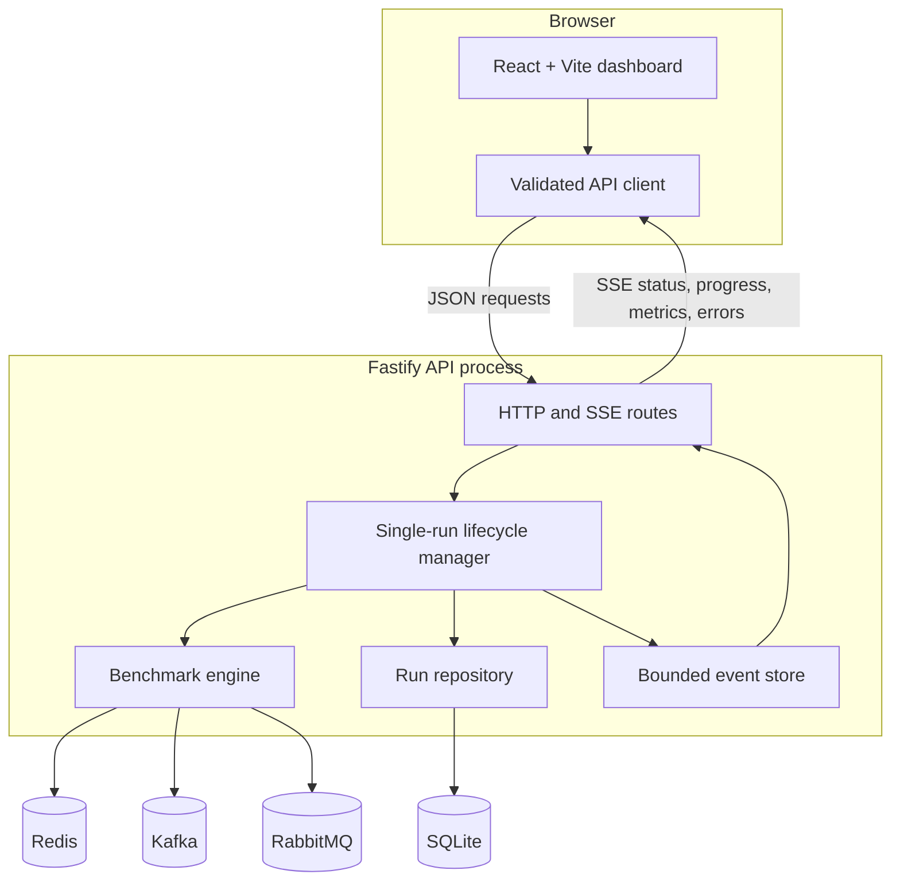
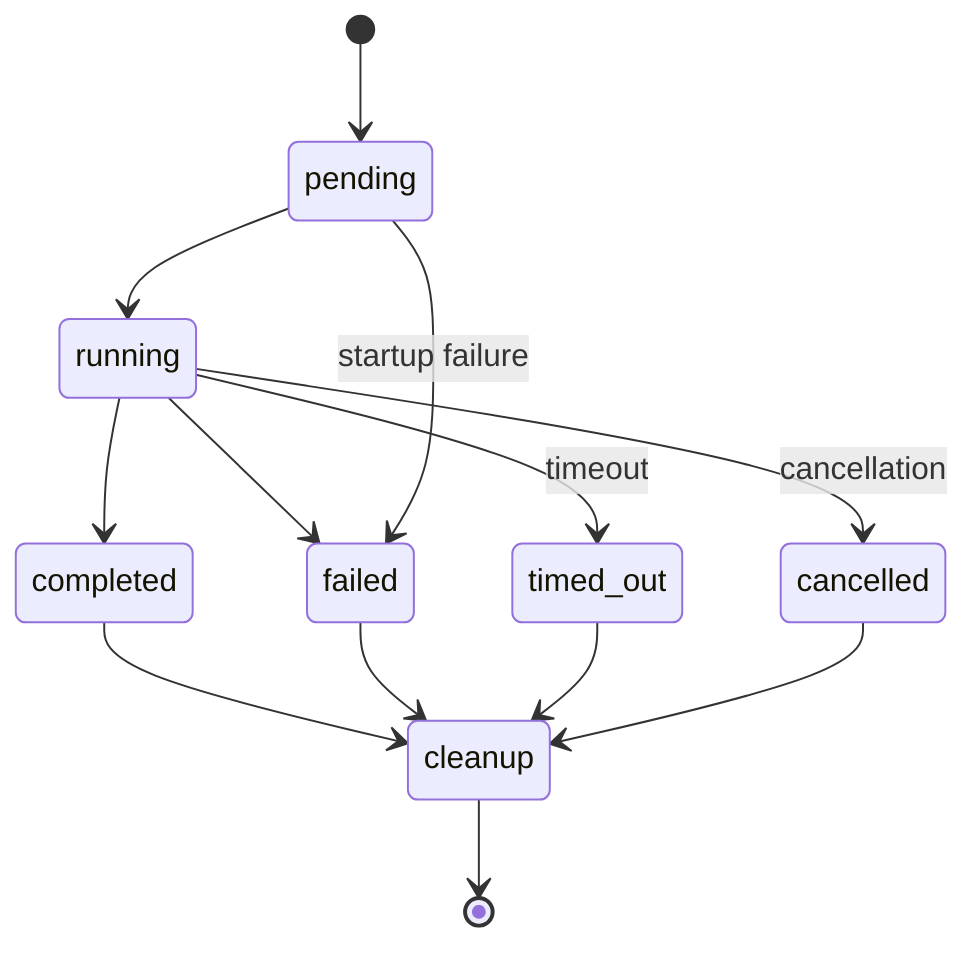
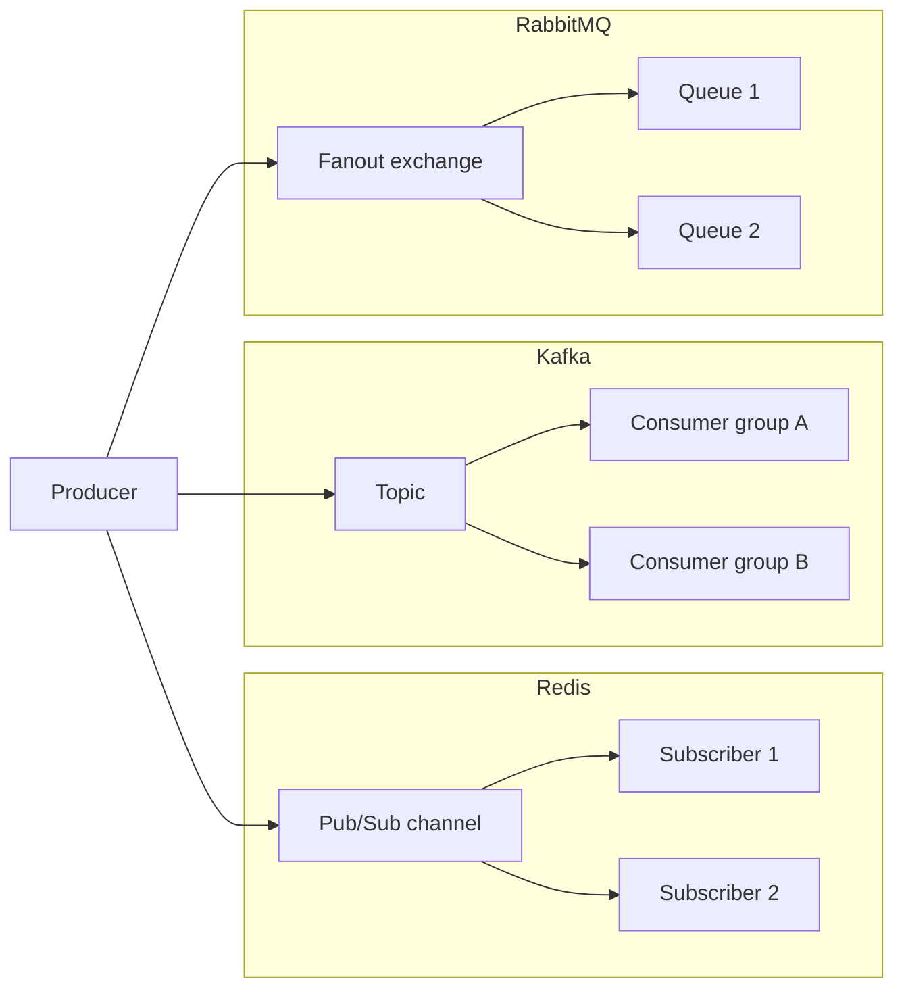
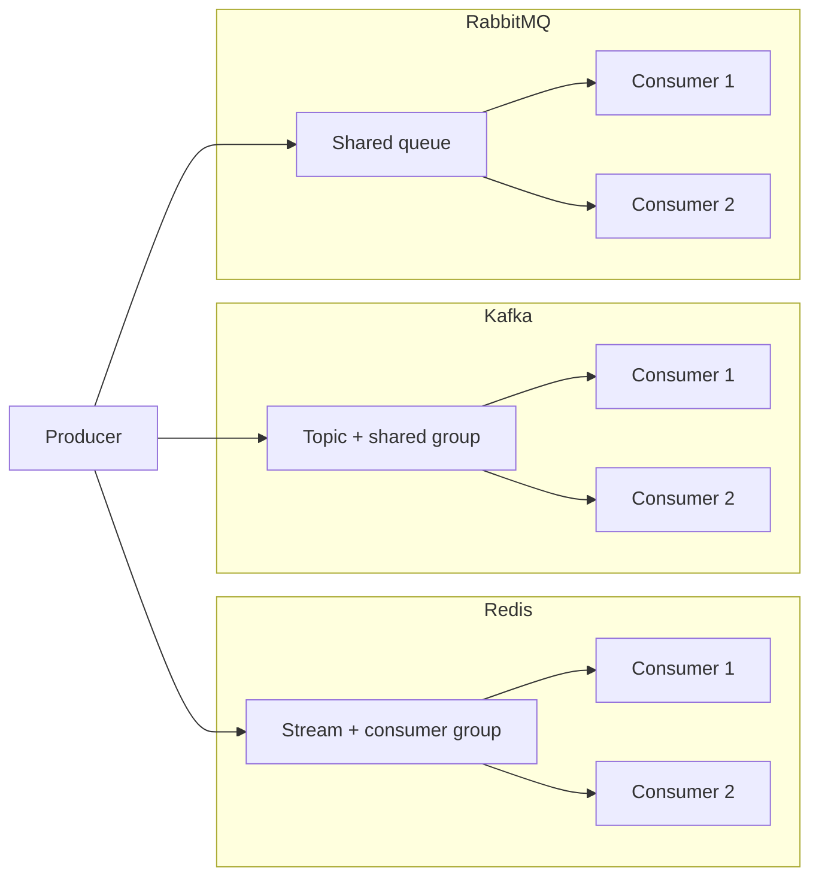

# Architecture and messaging flows

## System topology

The shared workspace owns the Zod schemas consumed by both applications. API responses and incoming SSE events are validated at the web boundary.

## Run lifecycle

Only one run may be pending or running. The manager uses an abort signal for timeout, cancellation, and graceful shutdown. Cleanup is attempted in every terminal path, and cleanup failures are persisted separately.

## Live fan-out

Each fan-out subscriber is expected to observe every message. Redis Pub/Sub is live-only; Kafka groups and RabbitMQ queues add persistence and acknowledgement behavior.

## Competing consumers

One consumer handles each message. Distribution depends on consumer readiness, broker scheduling, Kafka partition assignment, and acknowledgement timing; an even split is not guaranteed.

## Persistence model

SQLite stores one run row, one optional aggregate-metrics row, capability notes, and run errors. Individual message timings are deliberately kept out of the database. Named Docker volumes retain SQLite and broker data across ordinary `docker compose down` and restart operations.
