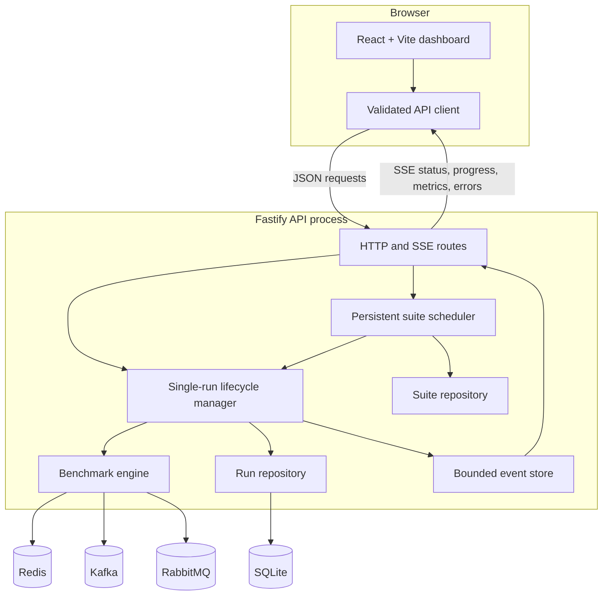
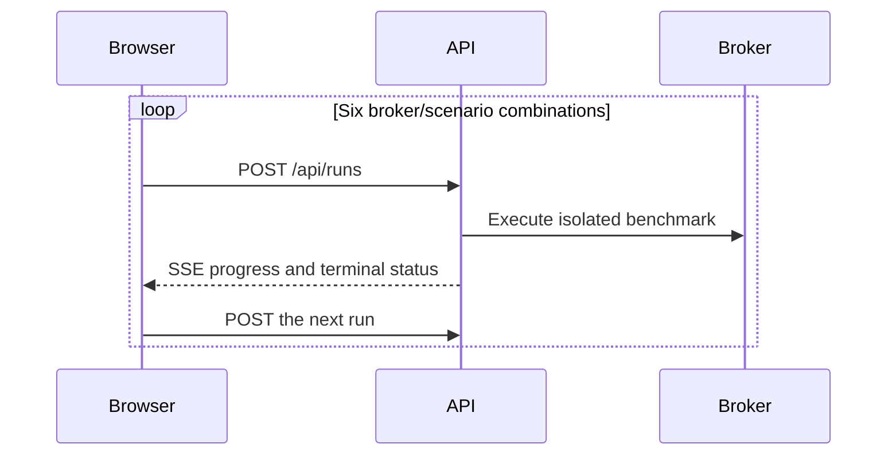
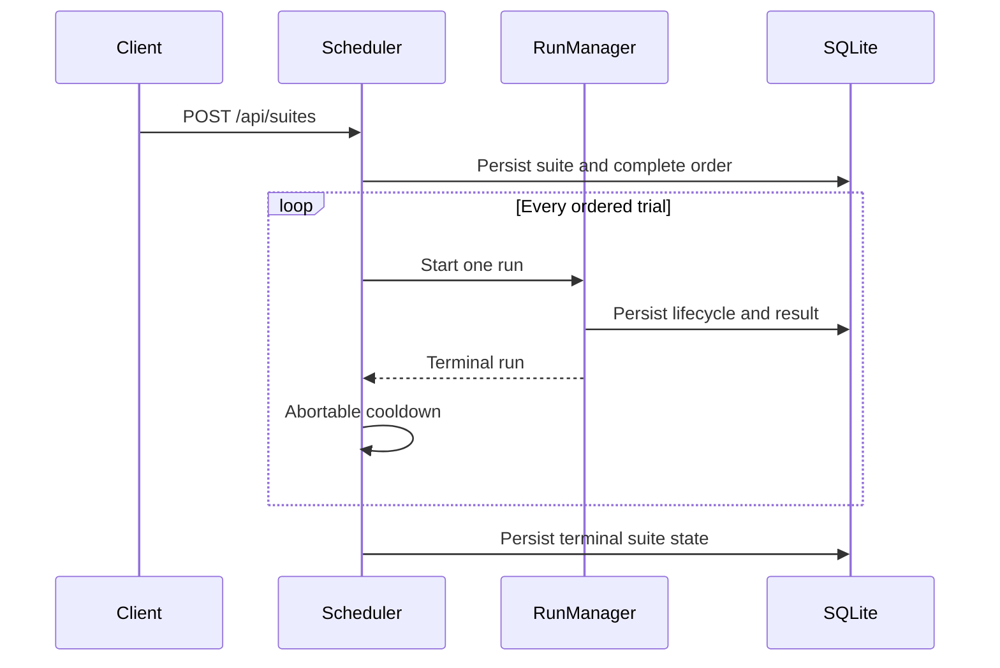
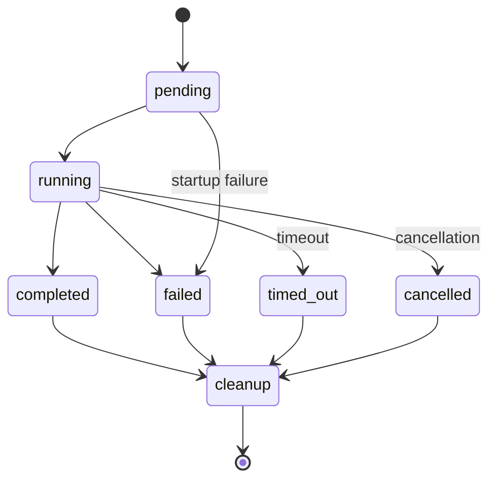
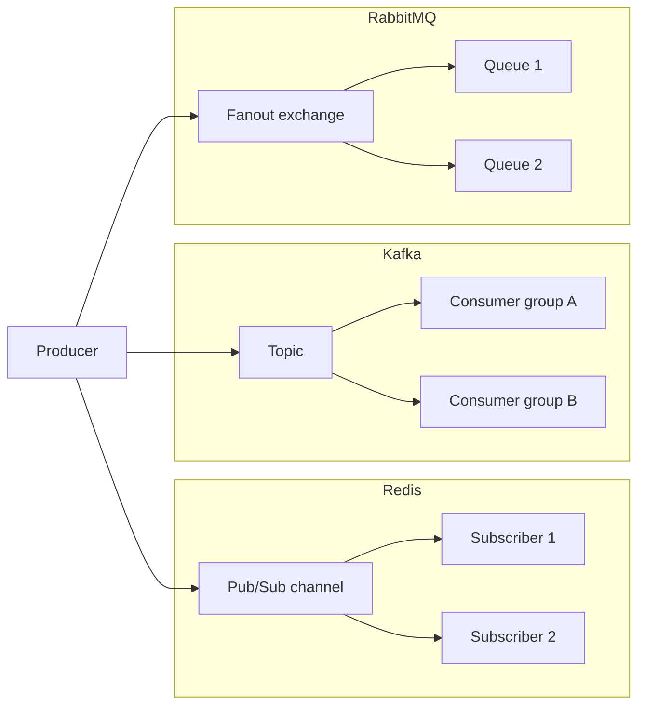
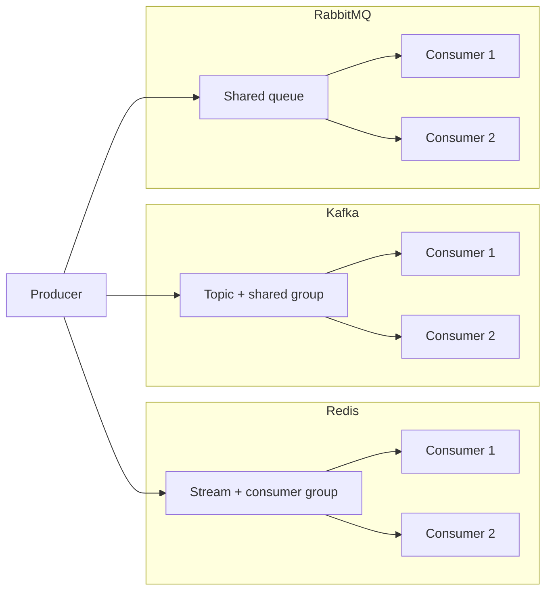

# Architecture and messaging flows

## System topology

The shared workspace owns the Zod schemas consumed by both applications. API
responses and incoming SSE events are validated at the web boundary. Validation
failures and structured server errors remain distinct from connectivity,
conflict, timeout, and broker failures in the client.

## Sequential runners

The dashboard's “Run all 6 sequentially” action is a client-side convenience.
It expands the selected workload into the six broker/scenario combinations and
submits one ordinary run at a time.

The queue exists only in browser memory. Reloading or closing the page discards
the remaining queue, while an already active API run continues and can be
rediscovered from run history.

The API also exposes persistent suites. Suite clients submit a normalized
workload, broker/scenario combinations, repetitions, ordering strategy, and
cooldown. The scheduler persists every ordered position first, then starts one
ordinary run at a time through the same lifecycle manager. The dashboard will
move to this API in the next UI milestone.

Fixed order repeats the selected combinations unchanged. Rotating order shifts
the first combination each repetition. Randomized order is shuffled once and
stored, so reconnects and later inspection see the exact executed sequence.
Failed, timed-out, and individually cancelled trials remain in the suite and do
not prevent later trials from running.

## Run lifecycle

Only one run may be pending or running. The manager uses an abort signal for timeout, cancellation, and graceful shutdown. Cleanup is attempted in every terminal path, and cleanup failures are persisted separately.

## Live fan-out

Each fan-out subscriber is expected to observe every message. Redis Pub/Sub is live-only; Kafka groups and RabbitMQ queues add persistence and acknowledgement behavior.

## Competing consumers

One consumer handles each message. Distribution depends on consumer readiness, broker scheduling, Kafka partition assignment, and acknowledgement timing; an even split is not guaranteed.

## Persistence model

SQLite stores run state plus suite configuration, lifecycle, errors, and ordered
suite-run membership. Versioned, transactional migrations advance `user_version`
before repositories access the database; a database from a newer application
version is rejected. Typed row mappers translate storage columns into the
shared runtime-validated domain model. Individual message timings are
deliberately kept out of the database. Named Docker volumes retain SQLite and
broker data across ordinary `docker compose down` and restart operations.

An API restart marks pending/running runs as failed and pending/running suites
as stopped. Automatic suite continuation is intentionally disabled because a
restart may change the benchmark environment. Graceful suite cancellation and
shutdown abort both cooldown timers and any active trial.
