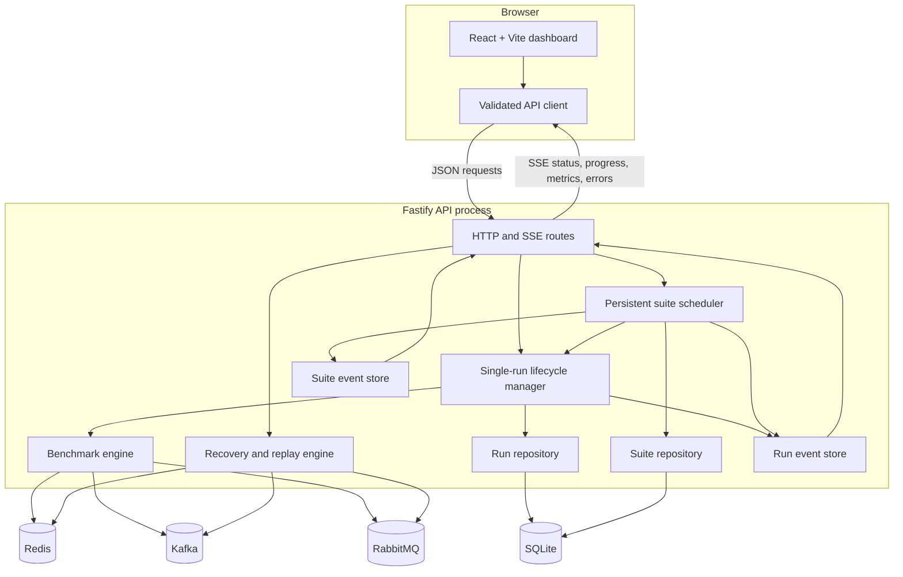
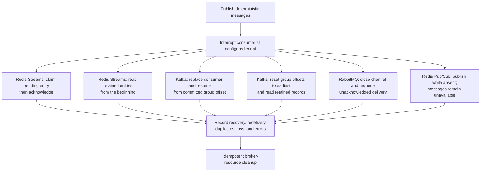
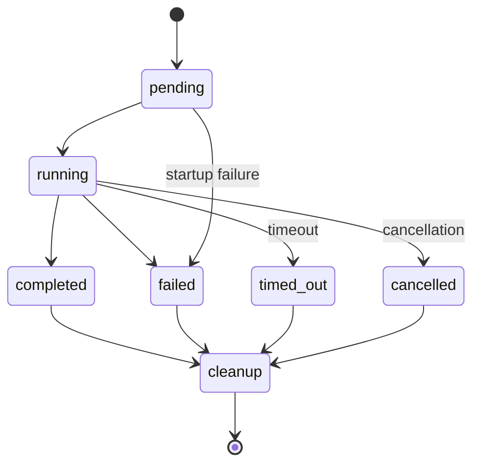
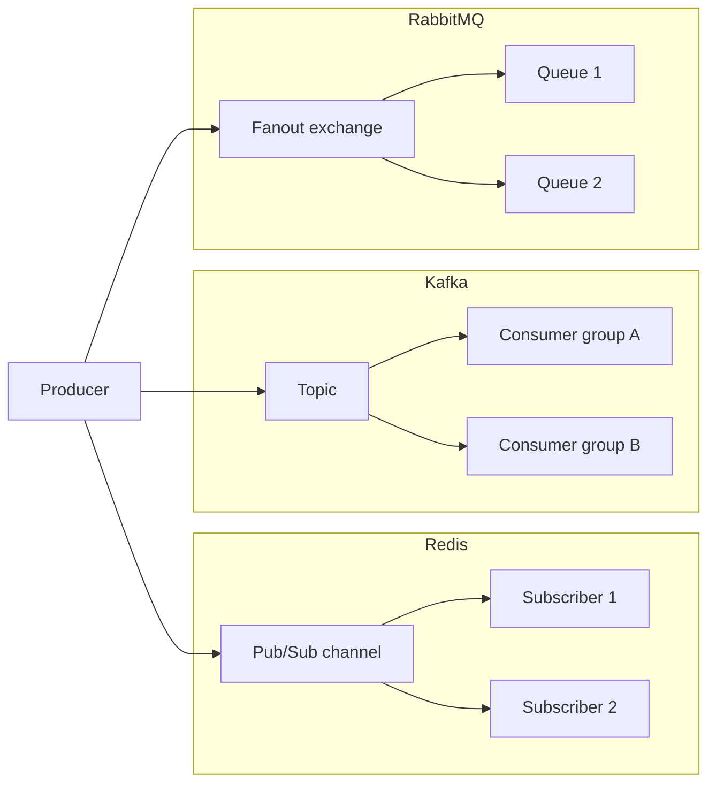
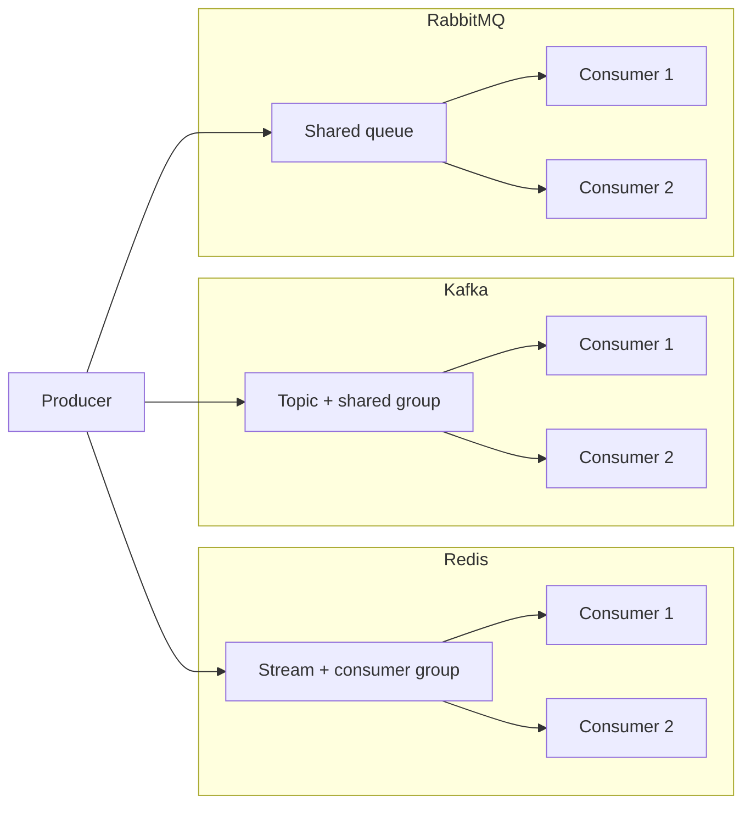
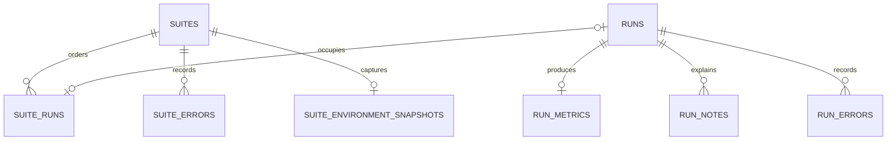

# Architecture and messaging flows

## System topology



The shared workspace owns the Zod schemas consumed by both applications. API
responses and incoming SSE events are validated at the web boundary. Validation
failures and structured server errors remain distinct from connectivity,
conflict, timeout, and broker failures in the client.

## Persistent suite runner

The dashboard submits a normalized
workload, broker/scenario combinations, repetitions, ordering strategy, and
cooldown. The scheduler persists every ordered position first, then starts one
ordinary run at a time through the same lifecycle manager. The browser only
creates, observes, cancels, and displays this server-owned resource.

```mermaid
sequenceDiagram
    participant Client
    participant Scheduler
    participant RunManager
    participant SQLite

    Client->>Scheduler: POST /api/suites
    Scheduler->>SQLite: Persist suite and complete order
    Scheduler-->>Client: 202 with pending suite
    loop Every ordered trial
      Scheduler->>RunManager: Start one run
      RunManager->>SQLite: Persist run and attach ordered position
      RunManager-->>Client: Nested run events over suite SSE
      RunManager-->>Scheduler: Terminal run
      Scheduler->>SQLite: Persist progress inputs
      Scheduler->>Scheduler: Abortable cooldown
    end
    Scheduler->>SQLite: Persist terminal suite state
    Scheduler-->>Client: Terminal suite event; close SSE
    Note over Client,Scheduler: Reconnect replays bounded events;<br/>browser disconnect does not stop work
    Client->>Scheduler: Optional cancel request
    Scheduler->>RunManager: Cancel active trial and abort cooldown
```

Fixed order repeats the selected combinations unchanged. Rotating order shifts
the first combination each repetition. Randomized order is shuffled once and
stored, so reconnects and later inspection see the exact executed sequence.
Failed, timed-out, and individually cancelled trials remain in the suite and do
not prevent later trials from running.

The suite owns the benchmark lane through cooldowns as recorded in
[ADR 0002](adr/0002-serial-server-managed-suites.md). Cancellation stops queued
work, aborts a cooldown, and cancels the active trial. Run and suite event
stores are separate and bounded to 500 and 1,000 events respectively. They are
process-local: after restart the suite endpoint synthesizes persisted progress,
summary, and terminal state instead of reconstructing every old nested event.

The suite lifecycle hook reconnects to active-suite SSE after reload. Stable
`?suite=` and `?run=` selections restore detail views, and history nests suite
trials beneath their owning suite while preserving standalone runs. All JSON
responses and suite events are runtime-validated with the shared schemas.

Each hydrated run and suite trial is classified as `primary`,
`adjacent-streaming`, or `ephemeral-baseline` from its broker and scenario.
The identifier is emitted in shared contracts and CSV exports. Mixed suites
remain valid scheduling containers, while summary counts and repeated-trial
distributions remain partitioned by track. Legacy rows need no rewrite because
classification is deterministic at hydration time.

## Recovery and replay flows

Recovery experiments use small deterministic message sets and interrupt at a
known delivery count. They return behavioral observations synchronously and do
not enter run history or performance aggregates.



Redis Streams and Kafka demonstrate both recovery state and retained replay.
RabbitMQ demonstrates redelivery of unacknowledged queue messages, not arbitrary
retained-log replay. Redis Pub/Sub explicitly demonstrates loss during
subscriber absence. Cleanup is attempted after success, cancellation, timeout,
or failure and its result is included in the response.

## Run lifecycle



Only one run may be pending or running. The manager uses an abort signal for timeout, cancellation, and graceful shutdown. Cleanup is attempted in every terminal path, and cleanup failures are persisted separately.

## Live fan-out



Each fan-out subscriber is expected to observe every message. Redis Pub/Sub is live-only; Kafka groups and RabbitMQ queues add persistence and acknowledgement behavior.

## Competing consumers



One consumer handles each message. Distribution depends on consumer readiness, broker scheduling, Kafka partition assignment, and acknowledgement timing; an even split is not guaranteed.

## Ordering and slow-consumer instrumentation

The benchmark wire envelope includes a global sequence plus producer identity,
producer-local sequence, and ordering key. Adapters attach a native ordering
scope on delivery: Kafka consumer-group partition, RabbitMQ queue, or Redis stream. The engine
keeps global and native-scope violation counters separate because those scopes
are not interchangeable. Redis Pub/Sub has no retained native ordering scope
in the current lab.

An optional consumer delay is applied before a measured delivery is recorded
and acknowledged. The engine records the maximum and final number of expected
published deliveries not yet observed by the application. This is explicitly
an application-boundary backlog observation, not a shared interpretation of
Kafka lag, RabbitMQ queue depth, and Redis pending entries.

In this adapter Kafka creates one partition per requested competing consumer,
so conventional consumer-group parallelism is partition-bound. RabbitMQ uses
one shared queue with explicit acknowledgements and configured prefetch. Redis
Streams uses one consumer group whose pending entries represent delivered but
unacknowledged work. These are broker-native demonstrations, not identical
internal mechanisms. See
[ADR 0001](adr/0001-semantic-comparison-tracks.md).

## Persistence model



SQLite stores run state plus suite configuration, lifecycle, errors, ordered
suite-run membership, and an immutable privacy-conscious environment snapshot.
The run and suite repositories own SQL and return shared domain objects. Typed
row mappers translate storage columns into runtime-validated models; route
handlers do not expose database rows. Individual message timings and recovery
experiment responses are deliberately not persisted.

### Migration catalog

| Version | Name                                   | Main change                                               |
| ------: | -------------------------------------- | --------------------------------------------------------- |
|       1 | Initial run storage                    | Runs, metrics, notes, errors, indexes                     |
|       2 | Persistent benchmark suites            | Suites, ordered membership, suite errors                  |
|       3 | Suite environment snapshots            | One immutable snapshot per suite                          |
|       4 | Named experiment history               | Names, descriptions, and history-filter indexes           |
|       5 | Parameter sweep suite points           | Optional sweep point index on ordered trials              |
|       6 | Ordering and backpressure observations | Consumer delay, ordering violations, and observed backlog |

At database startup, migrations newer than the current `PRAGMA user_version`
run in order. Each migration and its version advance share a `BEGIN IMMEDIATE`
transaction; any failure rolls the migration back. A database with a newer
version than the application supports is rejected rather than guessed at or
downgraded. Future migrations must use the next consecutive version, leave
released migrations unchanged, update row mappers, and test fresh creation,
upgrade compatibility, rollback, and relevant cascades.

Named Docker volumes retain SQLite and broker data across ordinary
`docker compose down` and restart operations.

An API restart marks pending/running runs as failed and pending/running suites
as stopped. Automatic suite continuation is intentionally disabled because a
restart may change the benchmark environment. Graceful suite cancellation and
shutdown abort both cooldown timers and any active trial.

History deletion is separate from broker cleanup. Only terminal standalone
runs or terminal suites can be deleted. Suite deletion uses one SQLite
transaction to remove suite metadata and its owned runs; foreign keys cascade
run metrics, notes, and errors. Delete endpoints never address broker resources
because cleanup belongs to the run lifecycle and persisted resource names may
already have been removed or reused.
