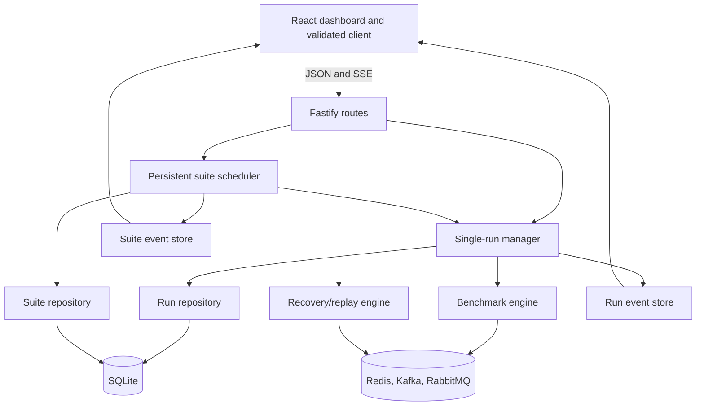
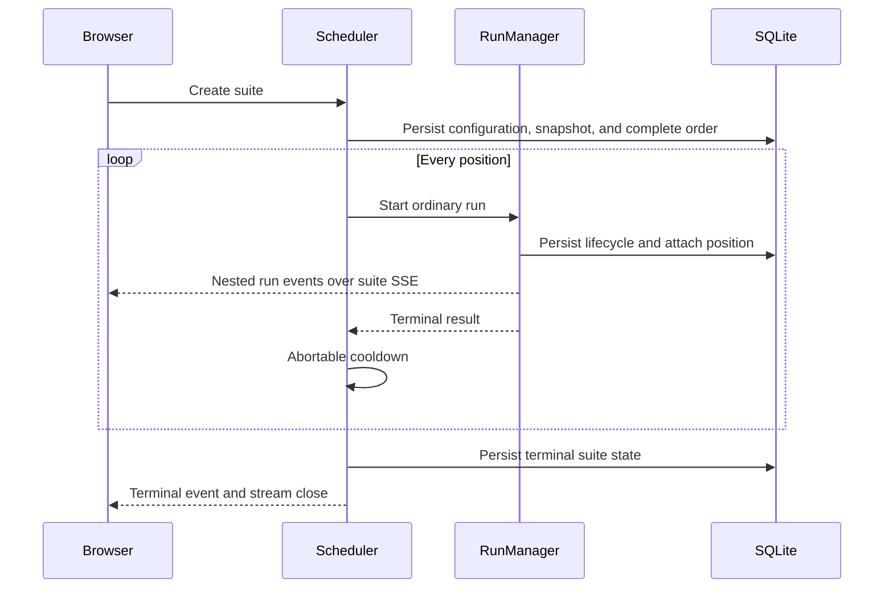
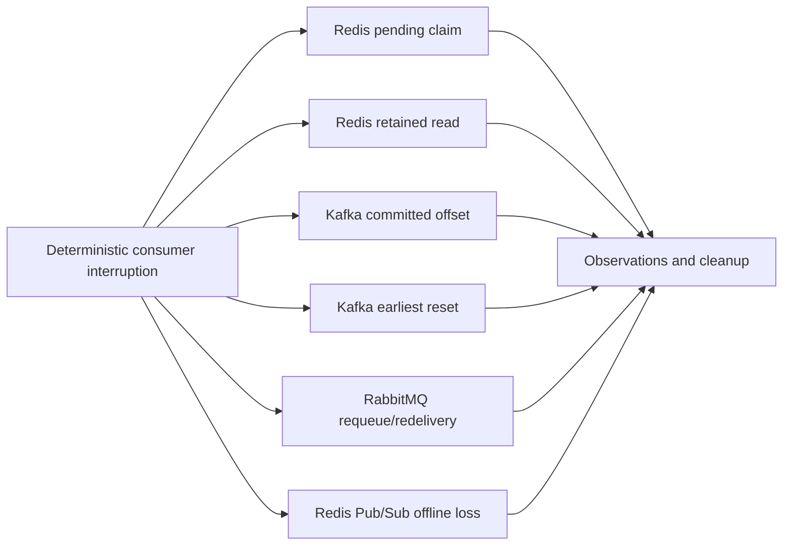
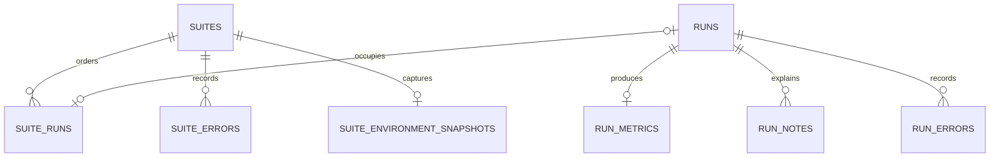

# Technical reference

This document combines architecture, API, persistence, local operation,
troubleshooting, and accessibility guidance for Messaging Lab.

## Architecture



| Workspace         | Ownership                                                            |
| ----------------- | -------------------------------------------------------------------- |
| `packages/shared` | Zod contracts, inferred types, limits, tracks, capabilities          |
| `apps/api`        | HTTP/SSE, lifecycle, scheduling, adapters, recovery, SQLite, exports |
| `apps/web`        | React UI, validated client, lifecycle hooks, pure selectors, charts  |
| `scripts`         | Compose, isolated E2E, and smoke orchestration                       |

The API permits one active run. A suite reserves that lane through every trial
and cooldown. The browser creates, observes, cancels, and displays suites; it
does not own an execution queue. See
[ADR 0002](adr/0002-serial-server-managed-suites.md).

### Suite flow



Fixed order repeats selections. Rotating order shifts the first case between
repetitions. Randomized order is generated once and persisted. Failed and
timed-out trials remain visible and scheduling continues. Cancellation aborts
cooldown, cancels the active trial, leaves later positions queued, and marks
the suite cancelled.

### Run and recovery flow

Run cancellation, timeout, failure, and shutdown share idempotent cleanup.
Every broker resource has a run-specific name. Cleanup failures are recorded
separately from the original failure.



Recovery responses are synchronous and not persisted. Redis Streams and Kafka
support the tested replay operations. RabbitMQ queue redelivery is recovery,
not retained-log replay; Redis Pub/Sub supports neither.

## HTTP API

The API defaults to <http://localhost:3000>. Successful JSON and every SSE data
event are validated against shared Zod contracts.

| Method and path                               | Purpose                                      |
| --------------------------------------------- | -------------------------------------------- |
| `GET /health`                                 | API process health                           |
| `GET /api/brokers`                            | Protocol health and capability metadata      |
| `POST /api/runs`                              | Start one asynchronous standalone run        |
| `GET /api/runs`                               | Filtered, paginated newest-first run history |
| `GET /api/runs/:id`                           | Run detail                                   |
| `POST /api/runs/:id/cancel`                   | Request active-run cancellation              |
| `DELETE /api/runs/:id`                        | Delete terminal standalone history           |
| `GET /api/runs/:id/events`                    | Replayable run SSE                           |
| `POST /api/suites`                            | Validate, persist, order, and start a suite  |
| `GET /api/suites`                             | Filtered, paginated suite history            |
| `GET /api/suites/:id`                         | Suite, ordered trials, summaries, provenance |
| `POST /api/suites/:id/cancel`                 | Cancel active suite work                     |
| `DELETE /api/suites/:id`                      | Cascade-delete terminal suite history        |
| `GET /api/suites/:id/events`                  | Replayable suite and nested-run SSE          |
| `GET /api/suites/:id/export?format=json\|csv` | Export every ordered trial                   |
| `POST /api/recovery-experiments`              | Run one synchronous native demonstration     |

Run history accepts `broker`, `scenario`, `status`, exact `suite`, inclusive
`dateFrom`/`dateTo`, `limit` (1–100), and nonnegative `offset`. Suite history
accepts the same filters. IDs are UUIDs. Unknown resources return 404; active
conflicts and invalid deletion/cancellation state return 409.

Errors use:

```json
{
  "error": {
    "code": "VALIDATION_ERROR",
    "message": "The request is invalid.",
    "details": {}
  }
}
```

### Creating work

Only `broker` and `scenario` are required for a standalone run; numeric fields
use the experiment-guide defaults. Runs accept an optional 120-character name
and 500-character description.

A suite requires a name and one or more unique `{ broker, scenario }`
combinations. Optional fields include description, resolved workload,
repetitions, `fixed`/`rotating`/`randomized` order, cooldown, and one sweep. The
complete expanded order and environment snapshot are stored before execution.

Recovery requests select one of:

- `redis-streams-pending-recovery`;
- `redis-streams-retained-replay`;
- `kafka-committed-offset-recovery`;
- `kafka-offset-reset-replay`;
- `rabbitmq-unacknowledged-redelivery`; or
- `redis-pubsub-offline-loss`.

They default to five messages, interruption after two, and a 15-second timeout;
limits are 2–100 messages and 1–60 seconds, with interruption before the final
message.

### SSE

Every data event uses `id: <sequence>`, `event: <type>`, and a complete JSON
contract in `data`. Run events are `status`, `progress`, `metrics`, and `error`.
Suite events are `status`, `progress`, `summary`, `run-event`, and `error`;
nested run events have their own sequence.

Run stores retain 500 events and suite stores retain 1,000 in memory. New
connections receive retained history and should deduplicate handled sequences.
The server sends `: heartbeat` comments every 15 seconds. Streams close on a
terminal status. After API restart, persisted suite progress, summary, and
status are synthesized; old process-local history is unavailable.

## Persistence



| Schema | Capability                                     |
| -----: | ---------------------------------------------- |
|      1 | Runs, metrics, notes, errors, indexes          |
|      2 | Suites, ordered membership, suite errors       |
|      3 | Immutable suite environment snapshots          |
|      4 | Names, descriptions, history-filter indexes    |
|      5 | Parameter-sweep point identity                 |
|      6 | Consumer delay, ordering, and observed backlog |

At startup the API reads `PRAGMA user_version`, rejects forward-incompatible
databases, and applies pending migrations in order. Each migration and version
advance share a `BEGIN IMMEDIATE` transaction. Future changes use the next
version and never edit a released migration.

Pending/running runs become failed after restart; their active suite becomes
stopped. Automatic continuation is disabled because conditions may have
changed. Terminal suite deletion transactionally cascades through membership,
snapshot, errors, owned runs, metrics, and notes. History deletion never
contacts brokers.

### Environment snapshot

Each suite stores capture time; application version and optional commit;
Node.js version; OS platform/release/architecture; logical CPU count and
optional memory; sanitized broker images and inferred versions; client and
transport; Kafka broker count, acknowledgement and topic policy; and RabbitMQ
prefetch. Registry hosts, hostnames, usernames, paths, endpoints, and
credentials are excluded. Legacy suites may return `environment: null`.

## Local operation

Prerequisites are Docker Compose, 4 GB of Docker memory, and Node.js 22.12+/npm
10+ for host-side development.

```sh
cp .env.example .env
npm run docker:up
```

| Service             | Default address          |
| ------------------- | ------------------------ |
| Dashboard           | <http://localhost:5173>  |
| API                 | <http://localhost:3000>  |
| Redis               | `localhost:6379`         |
| Kafka               | `localhost:9092`         |
| RabbitMQ            | `localhost:5672`         |
| RabbitMQ management | <http://localhost:15672> |

Ports bind to `127.0.0.1` and can be overridden with `.env.example` variables.
The API has no authentication and must not be exposed publicly. Example
credentials are development-only. `.env.example` is the canonical list of
runtime, port, broker image, connection, and provenance variables.

For source mode:

```sh
docker compose up --detach --wait redis kafka rabbitmq
npm install
npm run dev
```

Use `npm run docker:logs` and `npm run docker:down`; ordinary down retains named
volumes. `docker compose down --volumes` intentionally deletes normal-project
broker and application data.

### Verification

```sh
npm run format:check
npm run lint
npm run typecheck
npm test
npm run build
npm run test:integration
npm run test:e2e
npm run test:smoke
```

Integration requires healthy brokers on its configured ports. E2E and smoke
create isolated projects and remove their resources. Install Chromium once
with `npm run test:e2e:install`.

## Troubleshooting

- **Docker unavailable:** run `docker version`, `docker compose version`, and
  `npm run docker:config`; check Docker memory.
- **Port conflict:** override the host port and matching source-mode broker URL.
  Kafka must be recreated after changing its advertised host port.
- **Broker unhealthy:** inspect `docker compose ps` and the exact service log;
  restart that service before considering data deletion.
- **Source connection failure:** host-run API URLs use `localhost` ports, while
  Compose-internal URLs use service names.
- **SSE stalled:** verify `/health`, persisted detail, an open
  `text/event-stream`, proxy buffering, and API logs. Browser reload does not
  cancel a suite.
- **Migration error:** preserve the database and use a compatible application.
  Do not edit `user_version` or a released migration. Failed migrations roll
  back.
- **Playwright launch error:** run `npm run test:e2e:install` and preserve
  failure traces/screenshots/videos.
- **Orphaned test stack:** identify the exact `messaging-lab-e2e-<pid>` or
  `messaging-lab-smoke-<pid>` project before targeted `down --volumes
--remove-orphans`; never use broad prune commands.
- **Cleanup failure:** preserve run history, inspect the exact run-specific
  resource, and use broker-native tools. Deleting history does not retry broker
  cleanup.

## Accessibility

The dashboard uses landmarks, skip navigation, labeled native controls, table
captions, visible focus, polite progress announcements, and progress-bar value
text. Up/Down Arrow moves among history entries; Enter or Space selects one.
Cancellation, filters, comparison, export, and recovery controls remain
keyboard operable.

Playwright runs Axe scans on initial and populated states plus keyboard workflow
checks. Manual release review should cover 200% zoom, reflow, focus visibility,
screen-reader status announcements, meaningful chart text alternatives, and
readability without color alone.
